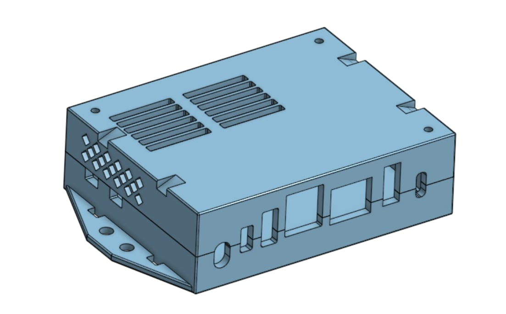

Here are the STL Files for printing the case. You should be able to print without supports. 

<!-- truncate -->

## STL Files

[Case Top](./2025-08-08-Case-STL-Files/Case-top.stl)

[Case Bottom](./2025-08-08-Case-STL-Files/Case-bottom.stl)

## Case Preview 

The case requires 3 M2.5x35mm long bolts to assemble. 

To attach the case to your robot, there are two options:
- Holes in the side wings
- Zip tie slots across the top

Please let me know if you have any questions or feedback regarding the design. 

<!-- truncate -->
