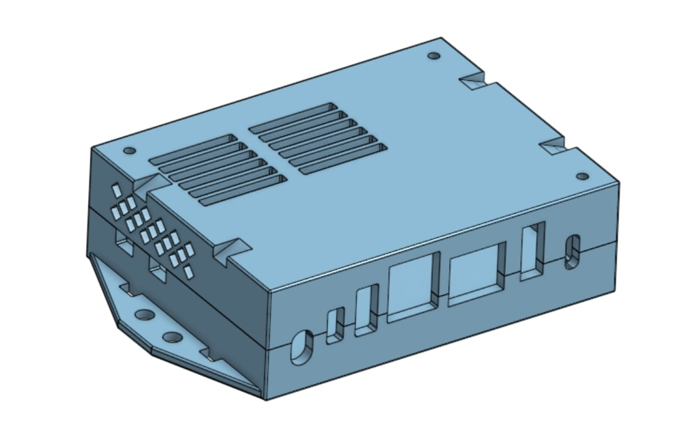

# Case
# Files

Here are the STL Files for printing the case. You should be able to print without supports. 

[Case Top](./Case-STL-Files/Case-top.stl)

[Case Bottom](./Case-STL-Files/Case-bottom.stl)

Here are the STEP Files. 

[Case Top](./Case-STL-Files/Case-Top.step)

[Case Bottom](./Case-STL-Files/Case-Bottom.step)

Here is the public Onshape link: 

https://cad.onshape.com/documents/ddcf4a5907a915d8429e3044/w/674d2139aeb5cd963ca206a0/e/7eb235fb6bf1cece4745baba

# Case Preview 

The case requires 3 M2.5x35mm long bolts to assemble. 

To attach the case to your robot, there are two options:
- Holes in the side wings
- Zip tie slots across the top

