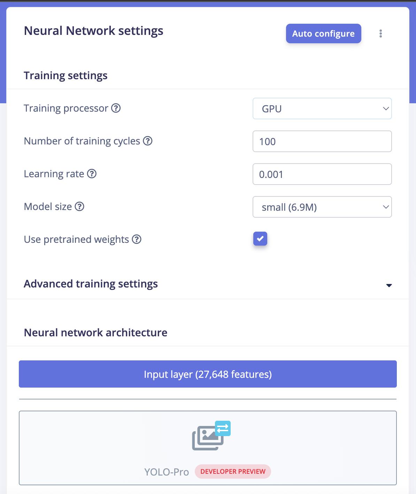
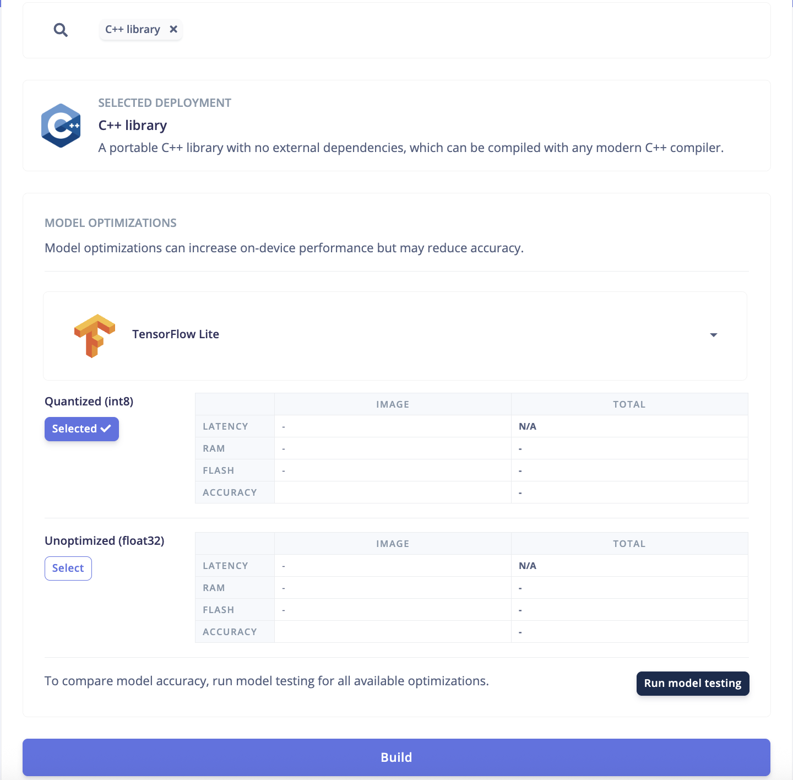

# Object Detection Tutorial

Create a custom YOLO-Pro model for your FIRST robot in 10 steps.

## Prerequisites

- ✅ Access to [FIRST Robotics Edge Impulse](https://firstrobotics.edgeimpulse.com/)
- ✅ 50-100+ images of game pieces from your robot's camera
- ✅ Camera mounted in competition position

---

## Step 1: Create Your Project

1. Go to [firstrobotics.edgeimpulse.com](https://firstrobotics.edgeimpulse.com/)
2. Create an account on the login page or sign in if you already have an account
3. Click **Create new project**
4. Name it (e.g., "2025-Game-Piece-Detection")
5. Click **Create project**

---

## Step 2: Create your AI Model

Follow steps 2-4 from the [Edge Impulse Object Detection Docs](https://docs.edgeimpulse.com/tutorials/end-to-end/object-detection-bounding-boxes) with these important modifications:

**During Step 3 - Designing an Impulse:**
- Use your camera mounted on your robot
- Set width and height to **640x640** (required for PhotonVision)

**During Step 4 - Configuring the Transfer Learning Model:**
- Change **AI Model** to **YOLO-Pro**
- Change **Training Processor** to **GPU**
- Your configuration should look like:

- Change the model size to tradeoff performance with accuracy
- **Nano** is our recommendation for most teams

---

## Step 3: Download Model

1. Go to the **Deployment** tab
2. Select **C++ Library**
3. Select **Tensorflow**
4. Select **Quantized Int8**
5. Click **Build**

Your configuration should look like this:

---

## Step 4: Deploy to Robot

:::note
PhotonVision to update how they want the deployment to work.
We'll update this section when we know more.
:::
---

## Step 5: Iterate & Improve

Machine learning is iterative. Your first model is just the beginning!

---

## Next Steps

🎉 **Congratulations!** You've created your first custom object detection model.

**Continue learning:**
1. Read [Best Practices](./best-practices.md) for advanced tips
2. Talk with others on Chief Delphi!

:::tip Remember
The best models come from continuous iteration. Each competition provides valuable data for improvement. Good luck! 🤖
:::
