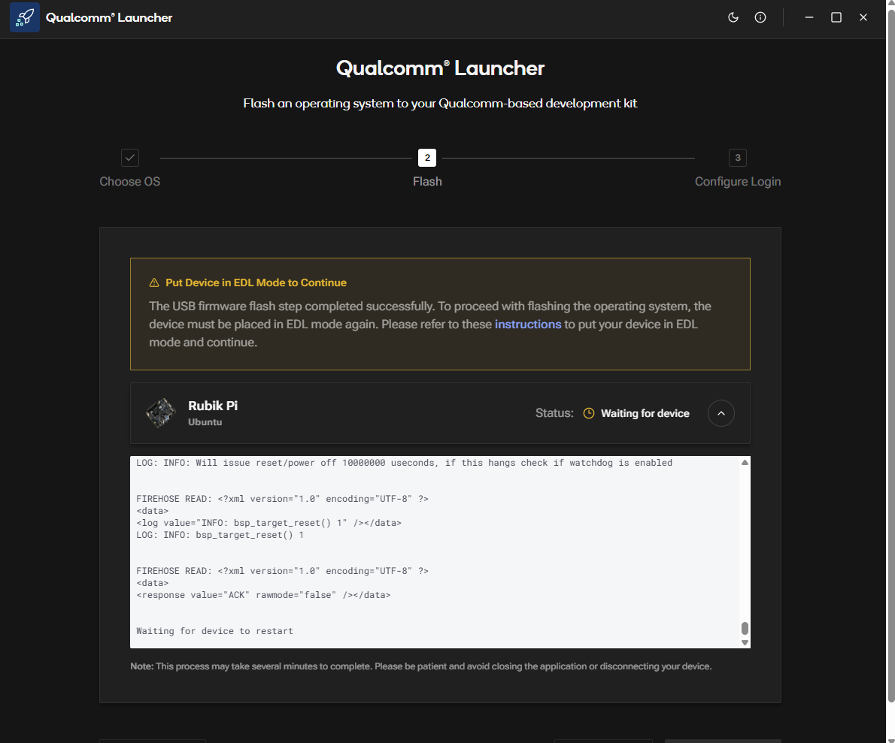

import Tabs from '@theme/Tabs';
import TabItem from '@theme/TabItem';

# Updating Software

Below are end user steps (Note: this is AFTER Production release is deployed):

1.  **Download the Installer:**
    Go to the QSC web portal: [https://softwarecenter.qualcomm.com/catalog/item/Qualcomm_Launcher](https://softwarecenter.qualcomm.com/catalog/item/Qualcomm_Launcher)
    OS Type and latest Version are selected by default. Click on "Download" to download the installer.
    
    :::caution
    Make sure you download the correct version for your host operating system.
    :::

    

2.  **Install the Qualcomm Launcher App:**
    Go through the installation process to install the Qualcomm Launcher app.

3.  **Flash the Device:**
    Launch the app. Select "Target Operating system", put your Rubik Pi device in EDL mode (instructions are included in the app), and then click on "Flash".

    

4.  **Flashing Process:**
    It will require the device to be restarted after flashing.. 
    If the device does not restart automatically, manually restart the device. 

    
    
   :::note
    Device will take a long time to flash.
   :::

    

5.  **Reboot the Device:**
    Once the flashing process is complete, the app will reboot your Rubik Pi device into the new operating system. You can also safetly unplug and replug the device.
