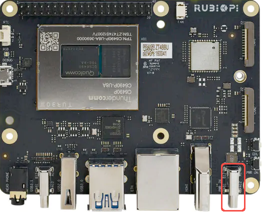
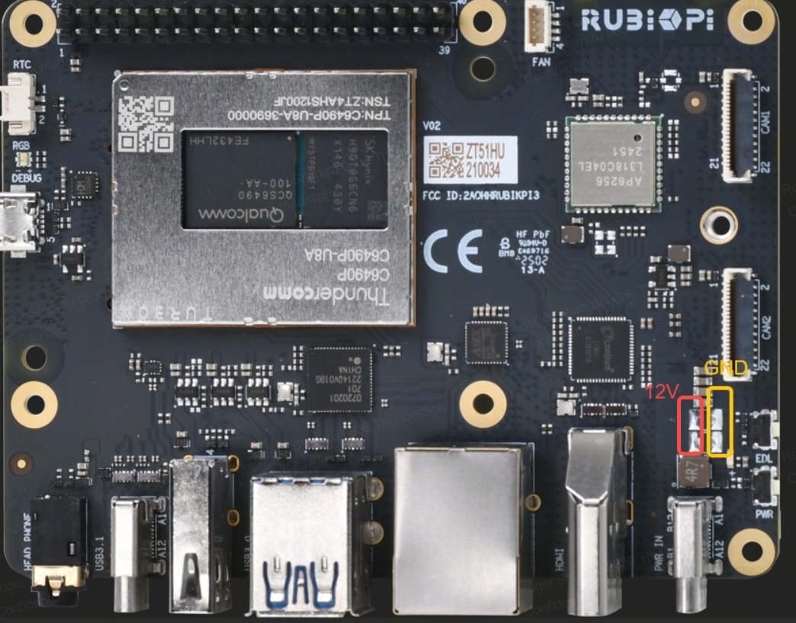

# Power
The RUBIK-Pi requires a minimum of 20W to operate reliably and can accept up to 36W. **When powering from a robot's variable 12V system, a buck-boost converter is always required** to provide stable 12V power. Using less than 20W may cause brownouts during high-processing workloads.

:::warning
**Power Requirement Warning**  
Always provide at least 20W to prevent system instability. Lower power supplies may cause unexpected reboots or hardware issues.
:::

## Recommended Power Setup for Robotics Applications

### Buck-Boost Converter 
Since robotics power systems provide variable 12V, a buck-boost converter is **mandatory** to regulate voltage to the required stable 12V for the RUBIK-Pi:

1. **Buck-Boost Converter**  
   [Pololu S13V25F12 Buck-Boost Converter](https://www.pololu.com/product/4984)  
   *Converts variable 12V input to stable 12V output*

2. **Connection Options**  
   Connect the converter output to the RUBIK-Pi using:
   - [USB-C live wire](https://a.co/d/bj8JPZ2) (direct connection to USB-C port)
   - [USB Power Delivery board](https://a.co/d/8IgLE1i) (for adjustable voltage)

:::caution
Ensure your buck-boost converter is properly configured for 12V output. Incorrect voltage settings may damage the RUBIK-Pi.
:::

### USB-C Power (For Non-Robotics Use Only)
*Only applicable when using a dedicated 12V power supply (e.g., phone charger or power bank)*

The USB-C port labeled **PWR IN** (next to the buttons) can accept 12V power directly:

- Requires a stable 12V/2A+ power supply (20W+)
- **Not suitable for direct connection to 12V robotics systems**

### Soldered Power (Advanced)
For advanced users, solder directly to the power headers (with stable 12V)

:::danger
**Not Recommended for FRC Systems**  
This method has not been tested with typical FRC power supplies. Always use a buck-boost converter for 12V systems.
:::
