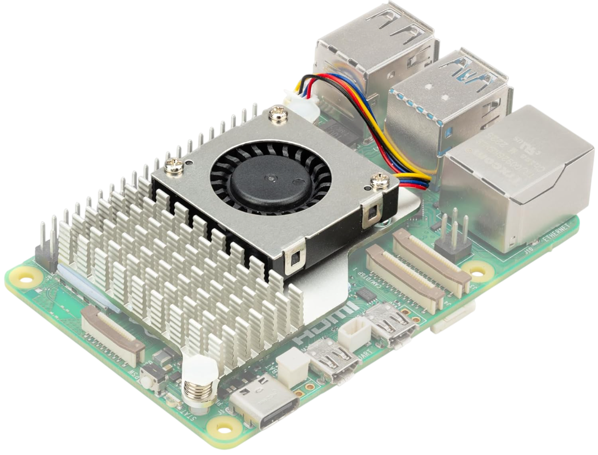
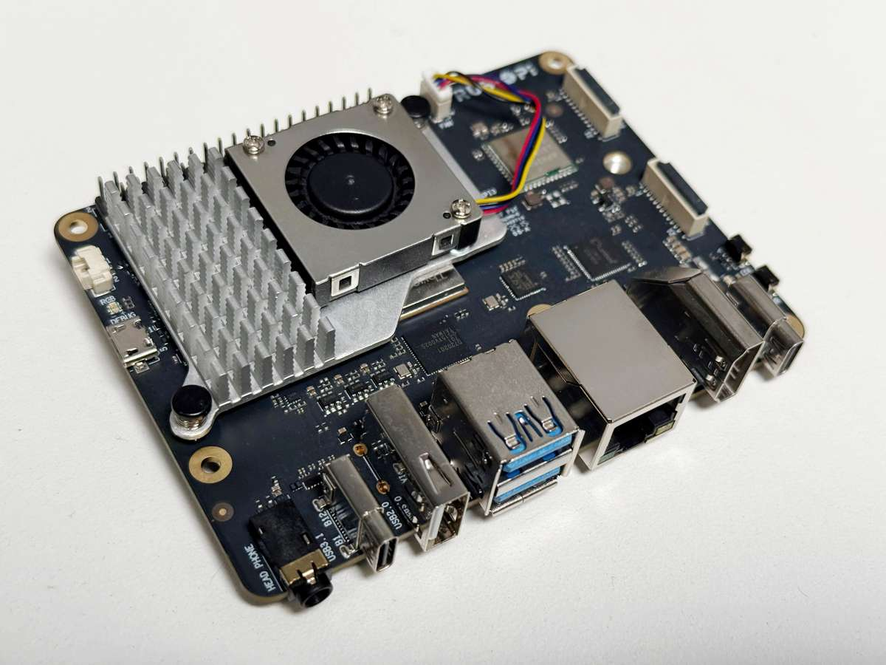
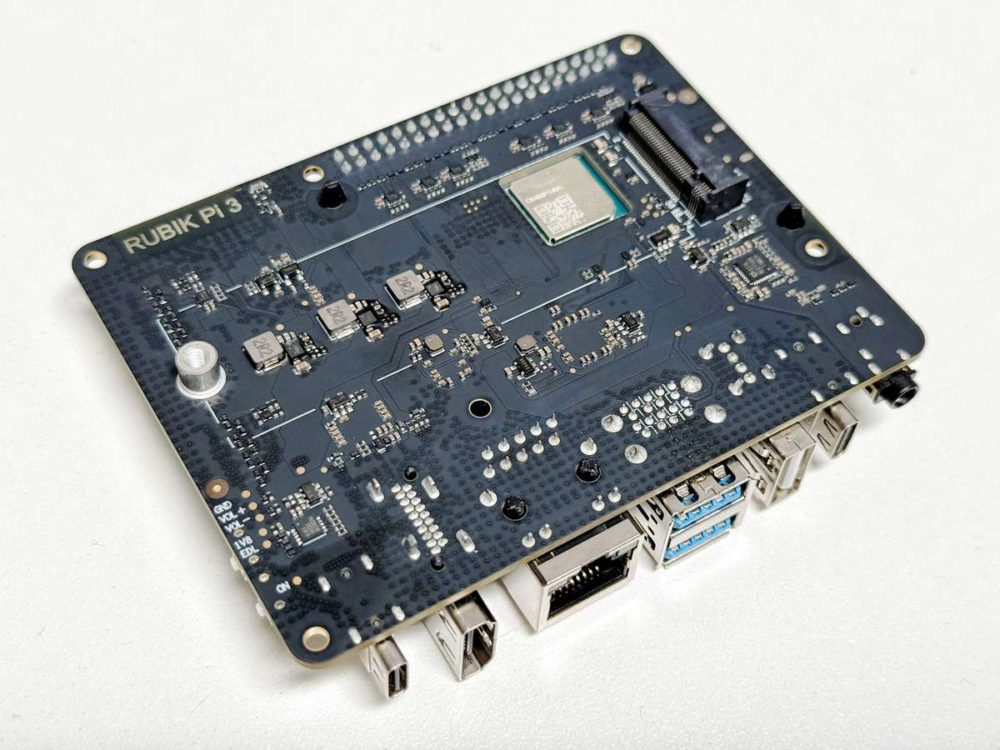

# Requirements

### Required Active Fan Cooler

The Rubik Pi takes the same active fan cooler as the Raspberry Pi.

:::warning
Without this you risk a chance of frying the Rubik Pi [Amazon Link](https://a.co/d/aFozNPB)
:::

When using RUBIK Pi 3 in high-load or high-performance scenarios, use cooling measures to ensure stable performance of the device. Otherwise, performance may fluctuate due to high CPU temperatures.
:::

### Install the fan

1. Paste the two thermal pads to the corresponding positions on RUBIK Pi 3.

   

2. Connect the fan cable.

  :::warning
  Make sure you orient the fan closest to the fan port correctly. 
  The orientation is shown in the image below.
  :::

   

3. Install the fan onto the RUBIK Pi 3 and secure it in place.
   
   

   

  :::warning
  
  We recommend that you do not remove the fan after installing it on your RUBIK Pi 3. Removal will cause the fan's push pins and thermal pads to degrade and may result in product damage. If the push pins are damaged, deformed, or not clipping securely, stop using the fan.
  :::