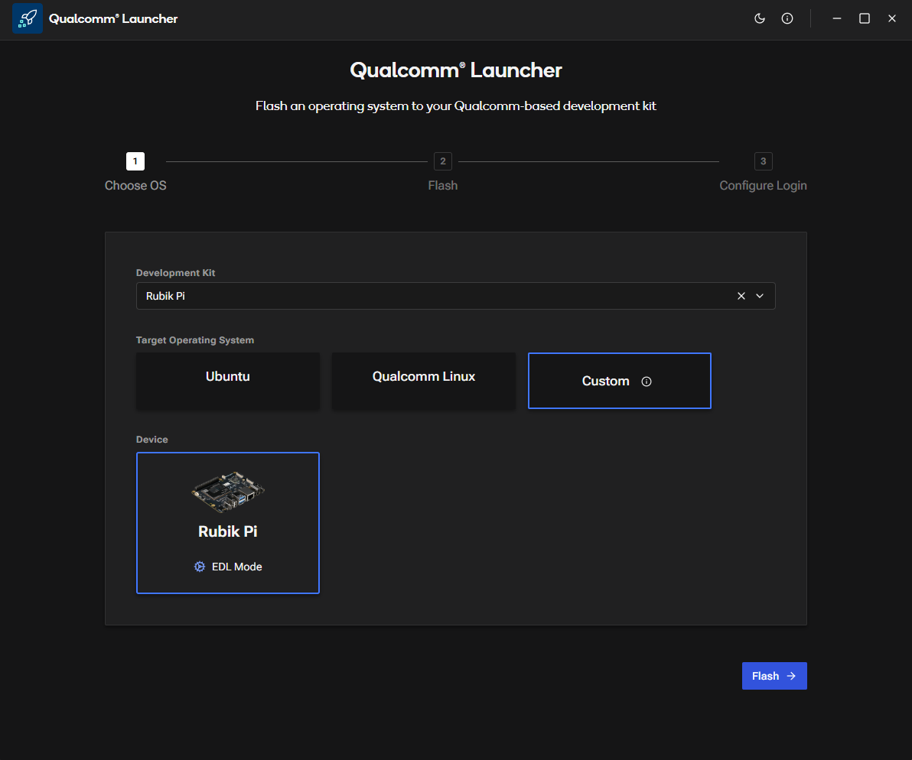

# Flash PhotonVision using Qualcomm Launcher

Qualcomm® Launcher is a user-friendly, GUI-based tool designed to simplify the process of downloading and flashing operating systems onto Qualcomm®-based development kits. This section provides step-by-step guidance to flash the **Renesas USB firmware** and replace the existing OS with a **certified Canonical Ubuntu 24.04 server** image.  

## User steps:  

### 1. Install Qualcomm Launcher
**a**. Visit Qualcomm Software Center web portal: **https://softwarecenter.qualcomm.com/catalog/item/Qualcomm_Launcher**    
**b**. Select the appropriate **OS type** and **architecture** based on your host machine.  
**c**. Choose the latest version and click Download to get Qualcomm Launcher. 

:::note
**Important:** On Linux hosts, Qualcomm Launcher v1.2.2 or later is required.
:::  

### 2. Flashing Operations  

**a**. In the Launcher, select the **Development Kit** as RUBIK Pi and the **Target Operating System** as Custom then point to newest PhotonVision build: https://github.com/PhotonVision/photonvision/releases  photonvision-xxxx-linuxarm64_rubikpi3.tar.xz

**b**. Switch the device to EDL mode (you can find instructions within the app). Once in EDL mode, the RUBIK Pi 3 will be automatically detected.    

 
**c**. Click Flash button to begin updating the Renesas USB firmware.    
**d**. A progress screen will display the status of the USB firmware flashing process.  

 

**e**. After successful USB firmware flashing, the following confirmation screen will appear.  
:::note
In the log message section, you’ll see the platform image being downloaded and the flash build process running in the background.
:::
 
**f**. Once the Launcher is waiting for user action to put the device into EDL mode, you will see the following screen.  

 

**g**. As soon as the device is placed into EDL mode, the flashing operation begins automatically. You will then see the following screen.

 

**h**. After the OS image is successfully flashed, the following confirmation screen will appear.

 

### 3. Click Finish Setup! and now your device is ready to use PhotonVision https://docs.photonvision.org/en/latest/docs/quick-start/index.html